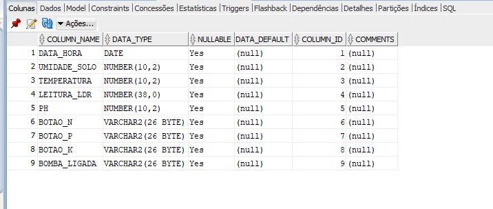
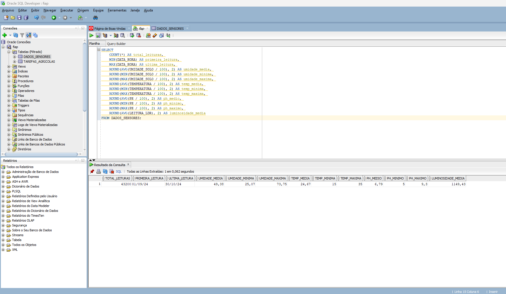
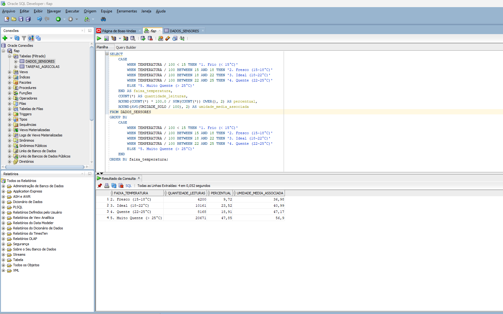
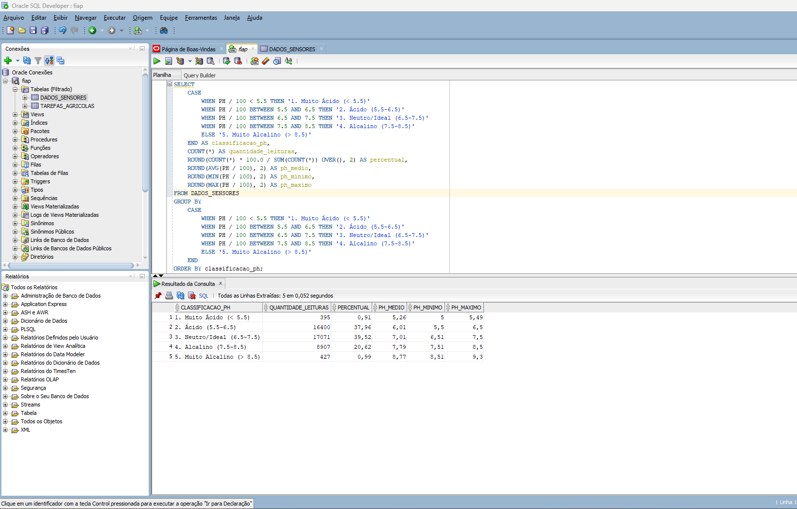
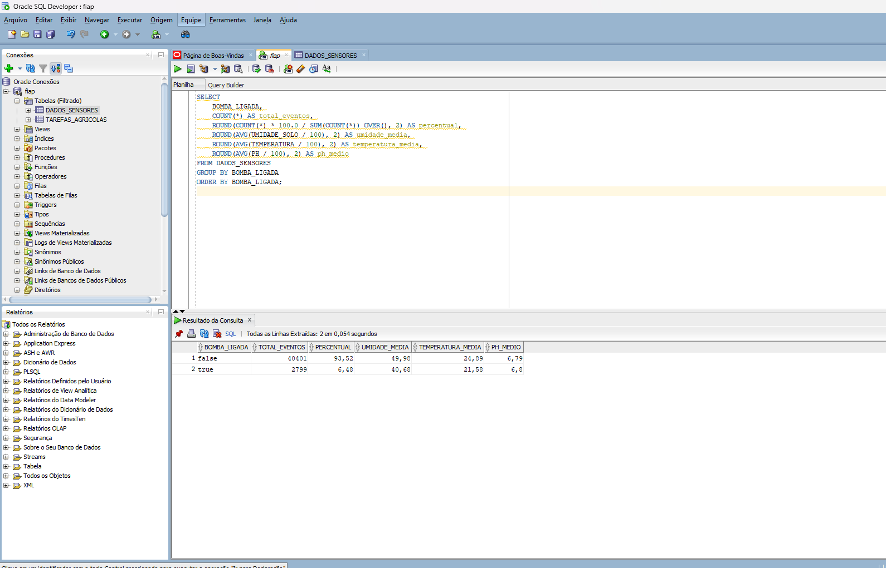
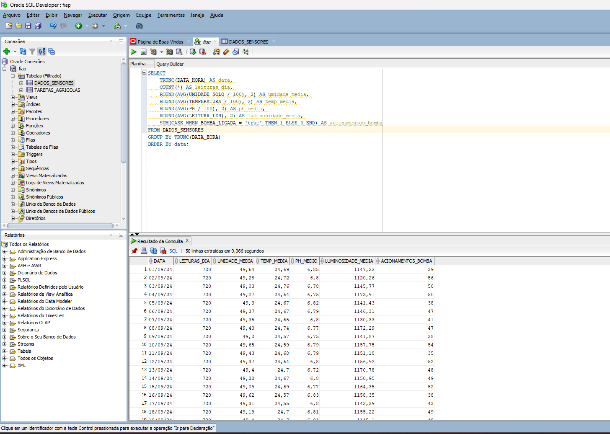

# FIAP - Faculdade de Informática e Administração Paulista

## Análise de Dados de Sensores - Sistema de Irrigação Inteligente

### 👨‍🎓 Autor
**Diogo Gose**

---

## 📜 Descrição do Projeto

Este projeto apresenta uma **análise detalhada dos dados coletados** pelo sistema de irrigação inteligente desenvolvido na **Fase 2 - Capítulo 10**. Os dados originais foram gerados através de uma simulação com ESP32 no ambiente Wokwi, onde sensores monitoravam condições ambientais e do solo para controlar automaticamente uma bomba de irrigação.

### 🔗 Projeto Original
Os dados analisados neste projeto são provenientes do sistema:
**[FarmTech Solutions - Simulador de Irrigação Inteligente](https://github.com/diogogose/fiap-fase2-cap10)**

### 🎯 Objetivo da Análise
Realizar análises estatísticas e consultas SQL sobre os dados coletados pelos sensores para:
- Identificar padrões de comportamento dos sensores
- Analisar eficiência do sistema de irrigação
- Gerar insights sobre condições ideais de cultivo
- Validar a lógica de acionamento da bomba de irrigação

### 📊 Dados Analisados
Os dados incluem leituras de:
- **Umidade do Solo** (%)
- **Temperatura** (°C)
- **pH do Solo** (escala 0-14)
- **Luminosidade** (leitura LDR)
- **Status da Bomba** (ligada/desligada)
- **Timestamp** de cada leitura

### ⚠️ Observação Técnica Importante
Devido a limitações na importação dos dados para o Oracle Database, os valores numéricos foram importados como **inteiros** ao invés de decimais. Por esse motivo, **todas as consultas SQL dividem os valores por 100** para obter os valores reais:
- `UMIDADE_SOLO / 100` → converte para percentual correto
- `TEMPERATURA / 100` → converte para graus Celsius corretos
- `PH / 100` → converte para escala de pH correta

---

## 📸 Visualizações do Projeto

### Estrutura do Banco de Dados


### Análise 1: Visão Geral dos Dados


### Análise 2: Distribuição de Temperatura por Faixas


### Análise 3: Classificação do pH do Solo


### Análise 4: Análise de Acionamento da Bomba


### Análise 5: Médias Diárias


---

## 🗄️ Consultas SQL Desenvolvidas

### 📌 Consulta 1: Análise Geral dos Dados
**Arquivo:** `database/consulta1.sql`

**Objetivo:** Obter uma visão estatística geral de todas as leituras dos sensores.

**Informações retornadas:**
- Total de leituras realizadas
- Primeira e última leitura (período de coleta)
- Média, mínima e máxima de umidade do solo
- Média, mínima e máxima de temperatura
- Média, mínima e máxima de pH
- Luminosidade média

---

### 📌 Consulta 2: Análise de Temperatura por Faixas
**Arquivo:** `database/consulta2.sql`

**Objetivo:** Classificar as leituras em faixas de temperatura e analisar sua distribuição.

**Faixas de Temperatura:**
- Frio (< 15°C)
- Fresco (15-18°C)
- Ideal (18-22°C)
- Quente (22-25°C)
- Muito Quente (> 25°C)

**Informações retornadas:**
- Quantidade de leituras por faixa
- Percentual de cada faixa
- Umidade média associada a cada faixa de temperatura

---

### 📌 Consulta 3: Classificação do pH do Solo
**Arquivo:** `database/consulta3.sql`

**Objetivo:** Categorizar o pH do solo e identificar condições ácidas, neutras ou alcalinas.

**Classificações:**
- Muito Ácido (< 5.5)
- Ácido (5.5-6.5)
- Neutro/Ideal (6.5-7.5)
- Alcalino (7.5-8.5)
- Muito Alcalino (> 8.5)

**Informações retornadas:**
- Quantidade de leituras por classificação
- Percentual de cada classificação
- pH médio, mínimo e máximo de cada categoria

---

### 📌 Consulta 4: Análise de Acionamento da Bomba
**Arquivo:** `database/consulta4.sql`

**Objetivo:** Avaliar a eficiência do sistema analisando quando a bomba foi acionada.

**Informações retornadas:**
- Total de eventos com bomba ligada/desligada
- Percentual de tempo que a bomba ficou acionada
- Condições médias (umidade, temperatura, pH) quando a bomba estava ligada/desligada

---

### 📌 Consulta 5: Médias Diárias
**Arquivo:** `database/consulta5.sql`

**Objetivo:** Agregar dados por dia para análise temporal e identificação de tendências.

**Informações retornadas:**
- Número de leituras por dia
- Média diária de umidade, temperatura e pH
- Luminosidade média diária
- Total de acionamentos da bomba por dia

---

## 📁 Estrutura de Pastas

```
Cap1/
├── database/
│   ├── dados_sensores.csv       # Dados coletados dos sensores
│   ├── consulta1.sql            # Análise geral
│   ├── consulta2.sql            # Análise de temperatura
│   ├── consulta3.sql            # Análise de pH
│   ├── consulta4.sql            # Análise da bomba
│   └── consulta5.sql            # Médias diárias
├── img/
│   ├── Estrutura_tabela_criada.png
│   ├── print_1_analise_geral.png
│   ├── print_2_analise_temperatura_por_faixa.png
│   ├── print_3_analise_ph_solo.png
│   ├── print_4_analise_acionamento_bomba.png
│   └── print_5_media_diaria.png
└── README.md
```

---

## 📋 Licença

MODELO GIT FIAP por Fiap está licenciado sobre Attribution 4.0 International.

